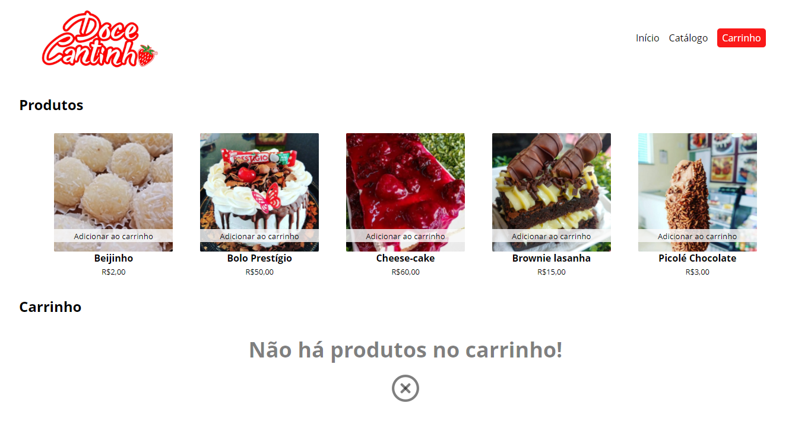
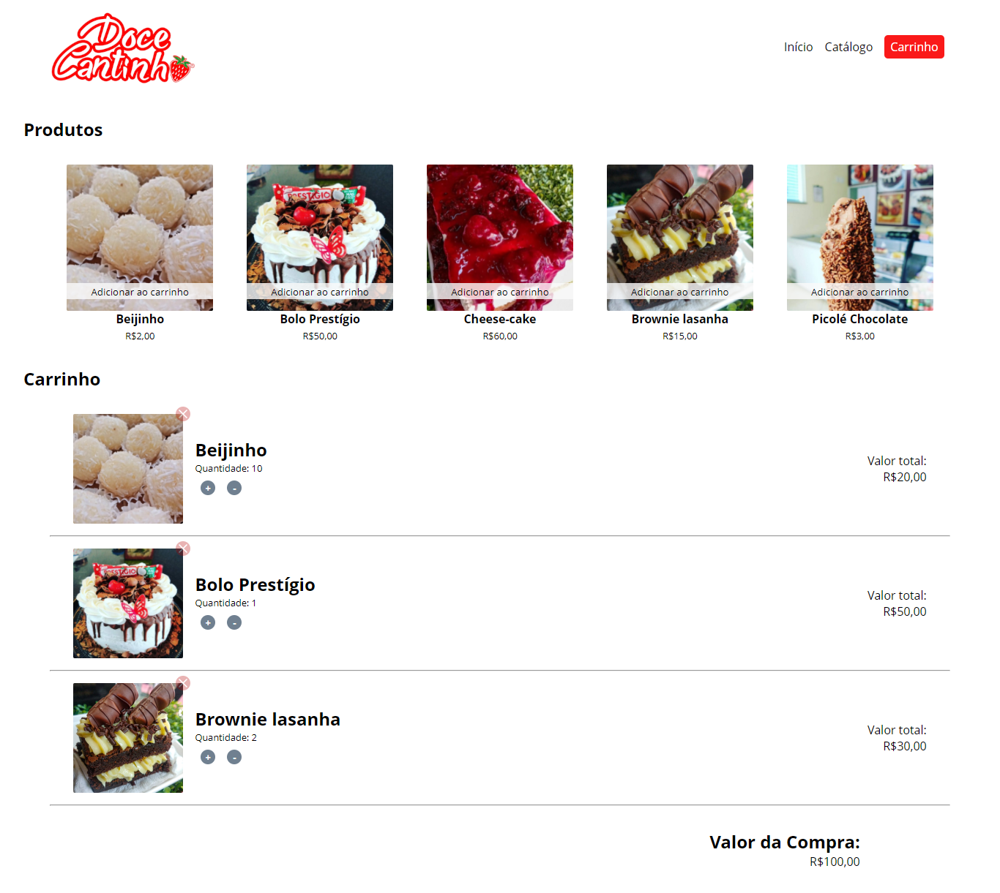

        

    

    <a href="https://henriquepinheiro12.github.io/Mini-Loja-Virtual-JavaScript-Vanilla/" target="_blank">Doce Cantinho´s cart 🍓</a>

# Mini Loja Virtual JavaScript Vanilla

Interactive page for a little confectionery store cart
Training some JS with this little project related with my DoceCantinho project
Focus on interactions with DOM elements 

## New Technologies learned

- [X] Object arrays
- [X] DOM manipulation with queries
- [X] Working with array of elements form the DOM 
- [X] map Array function
- [X] toFixed() number function
- [X] replace() string function
- [X] Variables hoisting
- [X] Context on arrow functions and regular functions
- [X] Concatenate HTML content with JS content

## Screenshots

    
        

